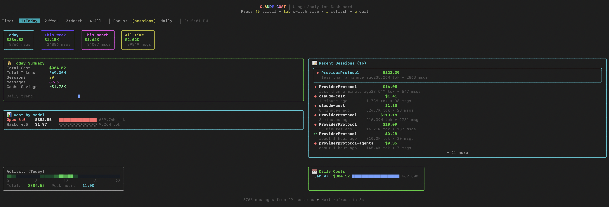

# claude-cost

Beautiful TUI dashboard for Claude Code usage analytics.



## Install

```bash
npm install -g claude-cost
# or
bun install -g claude-cost
```

## Usage

```bash
# Run the interactive TUI dashboard
claude-cost

# Or run directly without installing
npx claude-cost
bunx claude-cost

# Output stats as JSON (for scripts)
claude-cost --json
```

## Keyboard Controls

| Key | Action |
|-----|--------|
| `↑/↓` | Scroll through lists |
| `Tab` | Switch between views |
| `1/2/3/4` | Filter by time (today/week/month/all) |
| `r` | Refresh data |
| `q` | Quit |

## Data Source

Reads usage data from `~/.claude/projects/*/*.jsonl`

## JSON Output

```bash
$ bunx claude-cost --json
{
  "totalCost": "$2.02K",
  "totalTokens": "2924.70M",
  "sessions": 796,
  "messages": 39838,
  "breakdown": {
    "Haiku 4.5": {
      "cost": "$24.95",
      "tokens": "110.71M"
    },
    "Opus 4.5": {
      "cost": "$1.98K",
      "tokens": "2800.40M"
    },
    "Sonnet 4.5": {
      "cost": "$11.33",
      "tokens": "13.59M"
    }
  }
}
```
